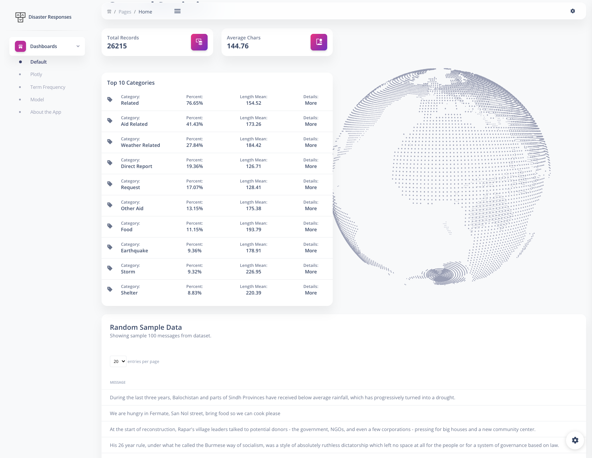
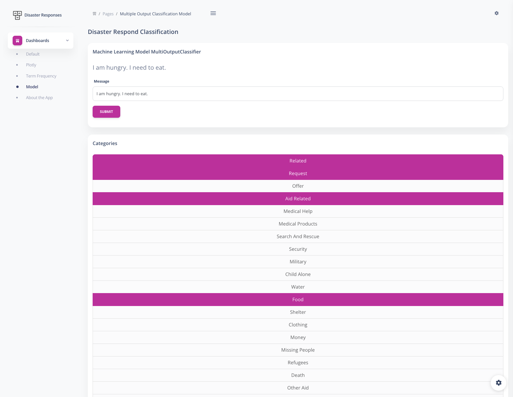
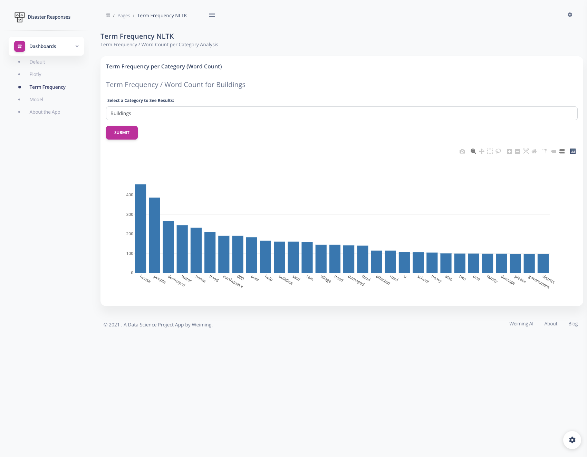
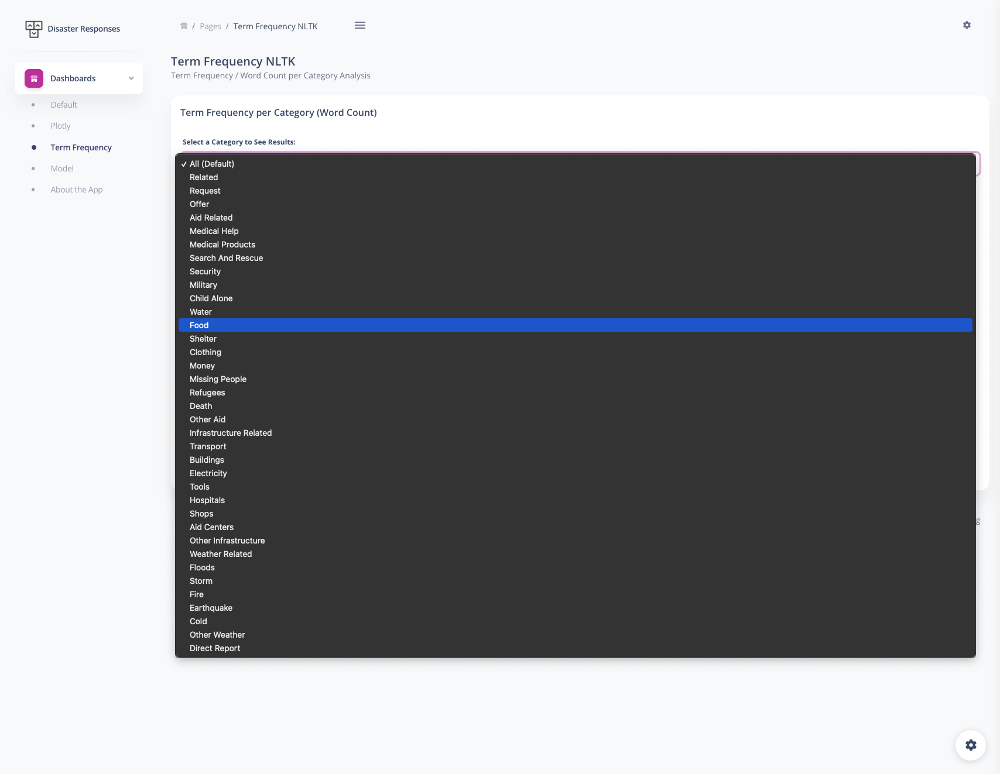
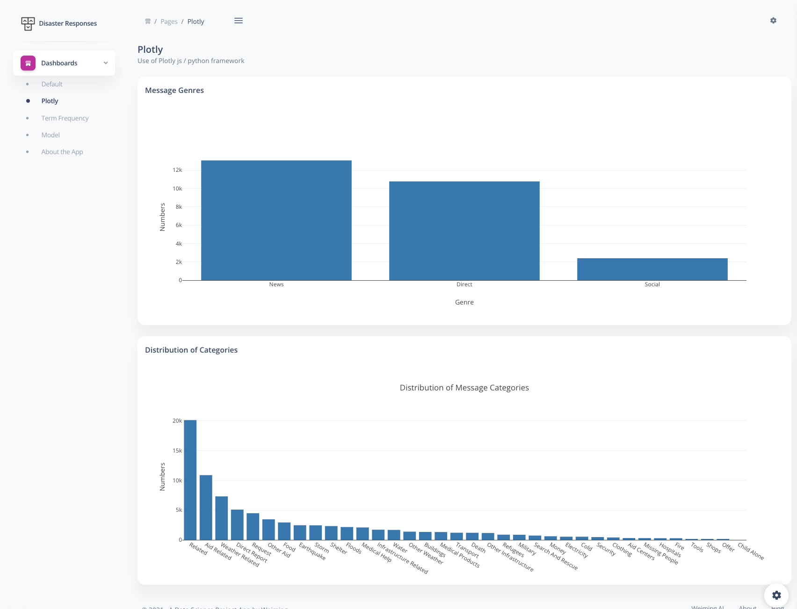
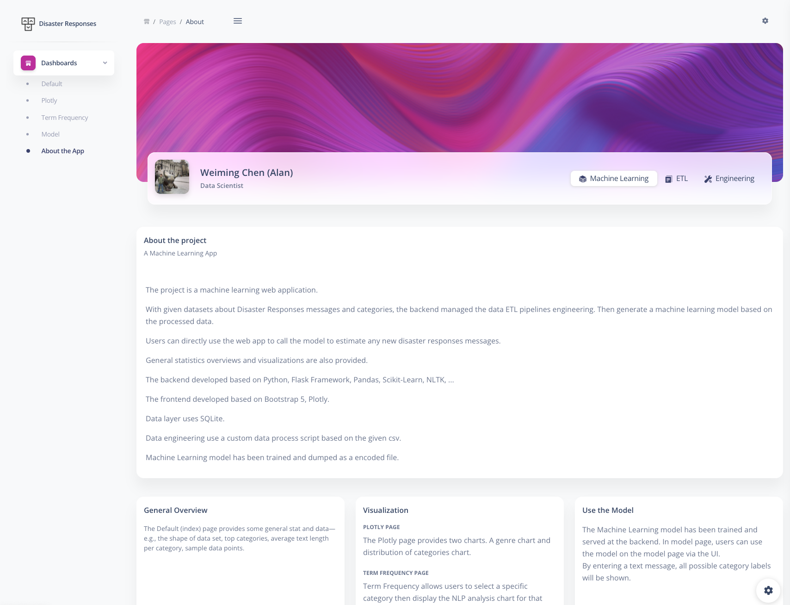

# Project Disaster Responses (a Machine Learning app)

## Environments and Libraries
- Python 3.9
- Pandas
- Flask, Flask-WTF
- Plotly
- Scikit-Learn
- SQLAlchemy
- NLTK
- Bootstrap 5

---

## What is this app about?
The app allows users to use a machine learning model by inputting a disaster response message and getting an output of possible categories estimated by the model. 
The app also provides some interactive visualization about the dataset and model. 


---


## Application Architect
Flask + Bootstrap + SQLite + Plotly + Machine Learning Model

The app uses Python, Flask Framework as backend. 
A customized Bootstrap 5 theme as frontend UI. 
The data layer uses SQLite and CSV. 
Use Scikit-learn to train a machine learning model (classification, multiple output class). 

(With NLTK, NLP processing inside)

---


## How to run the app

```bash
cd PATH_OF_PROJECT_ROOT
source vene/bin/active
python app.py
```

---


## File Structures

```bash
- (Project Root)
---- static
-------- static/assets (frontend UI files)
-------- static/csv (raw dataset)
-------- static/db (sqlite file)
-------- static/machine_learning_models (encoded models)
---- templates (jinja templates)
- app.py (app main file)
- process_data.py (ETL pipelines file)
- train_classifer.py (model training file)
- ...
```

---


## ETL Pipelines

to run ETL, under project root directory.
```bash
python process_data.py static/csv/messages.csv static/csv/categories.csv static/db/DisasterRes.db
```

---


## Train Machine Learning Model
Under project root directory.
```bash
python train_classifier.py static/db/DisasterRes.db
```

---


## About the trained model

The model dumped is used with the hyper-parameters tuning of:
```python
'features__text_pipeline__vect__ngram_range': ((1, 1), (1, 2)),
'features__text_pipeline__tfidf__use_idf': (True, False),
'clf__estimator__n_neighbors': [4, 5, 6]
```

It results in an overall accuracy score 0.939.
The encoded (serialized) file size \> 100MB, cannot git to GitHub. 
To reproduce this model, run the training locally. 
It depends on the machine’s speed. It took my (so old) laptop almost an hour to train this. 
My trained version is downloadable here: https://www.dropbox.com/s/o2iap7gud8yjywd/released\_model.pkl?dl=0

---

## Visualization
The app provides three visualization plots. 
1. Genre Distribution (on /plotly page)
2. Category Distribution (on /plotly page)
3. Term Frequency Analysis (on /tf page)

For the TF Analysis page, an interactive form is added. Users can select any category for the result. 

---

## About /tf page (Term Frequency Analysis)


The pages use CounterVectorizer to compute word count. 
To be more specific about term frequency context, we might consider using TfidfTransformer or TfidfVectorizer to get TFIDF values and put them together with word counts. 
However, for visualization illustration purposes, I would use CounterVectorizer. 
For a more ‘pro’ version, consider plotting {word, count of the word, TFIDF of the word} as a dataset. Then, make the TFIDF value to show when the user hovers over the word. 

---

## Application Screenshot










